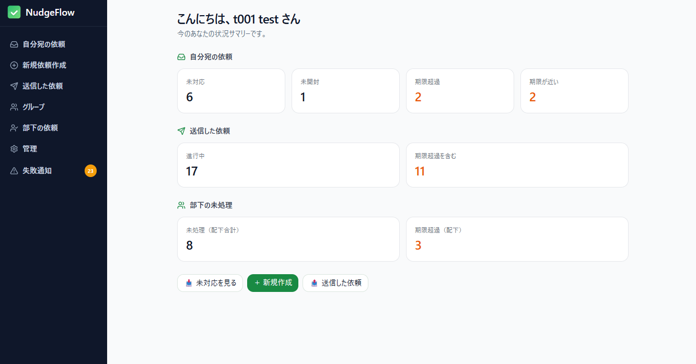
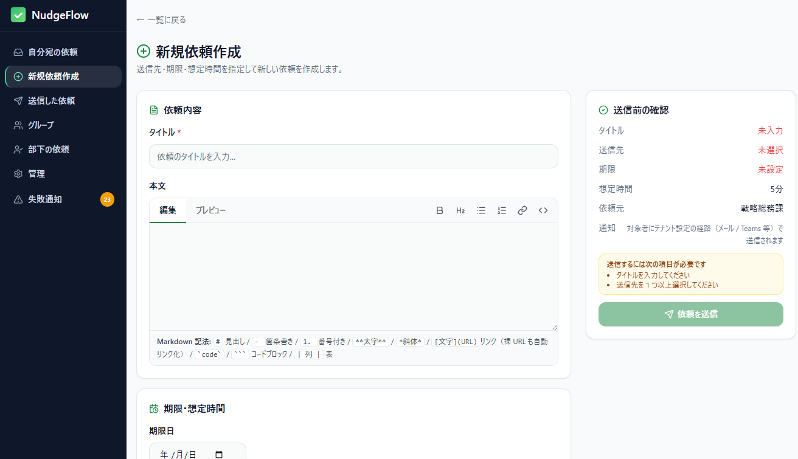
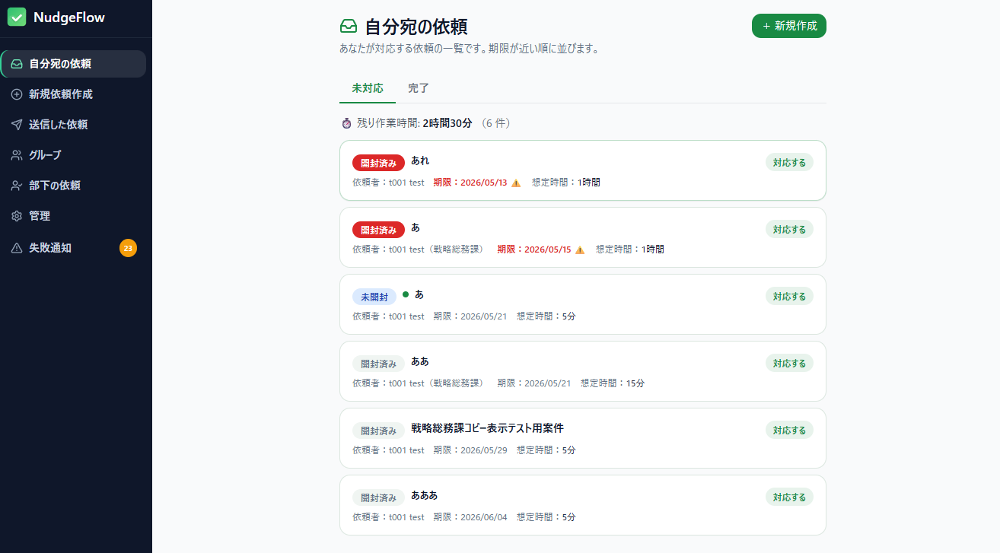
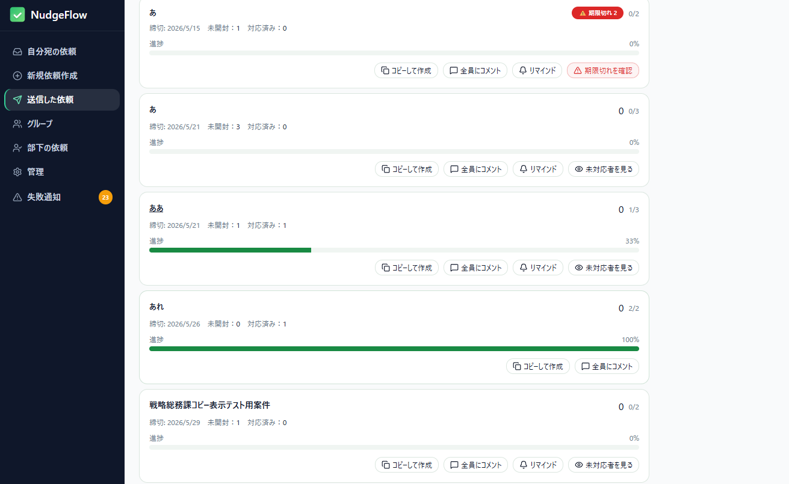
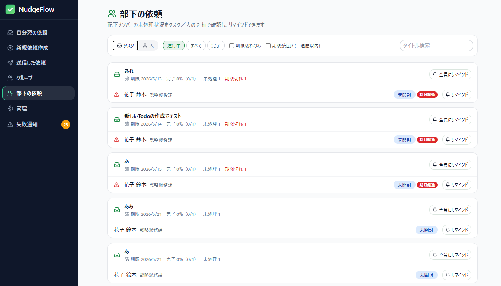
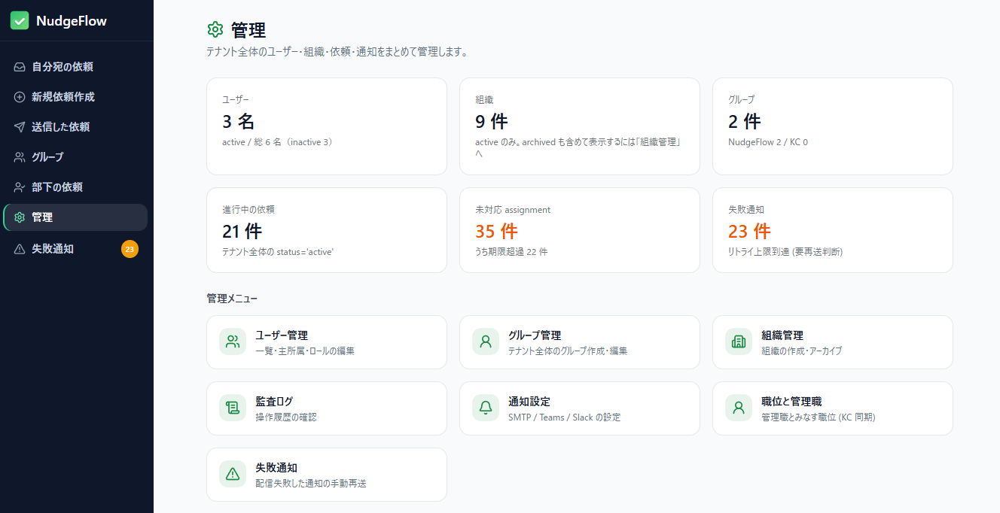

# NudgeFlow — 業務依頼を「見える化」して督促を軽くする

> 組織内の依頼事項（アンケート・作業依頼）を軽く促し、対応状況を可視化する OSS タスク管理ツール。
> Keycloak 連携・マルチテナント・メール/Teams/Slack 通知に対応。

---

## こんな課題はありませんか

- メールで「お願いします」→ **誰がまだ対応していないか分からない**
- 締切が来ても **督促が個別メールで重い**、抜け漏れる
- 退職・異動で **依頼の引き継ぎが宙に浮く**
- 管理職が **部下の未処理状況を一覧で把握できない**

NudgeFlow は、行政・大企業のように依頼が多段で流れる組織向けに、
**依頼の送信 → 対応 → 督促 → 通知** をテナント単位で一元化します。

## 全体像

ログインすると、自分の状況がダッシュボードでひと目で分かります。



## 主要機能

### 1. 依頼の作成と配信
個人 / 組織 / グループを送信先に指定。Markdown 本文（裸 URL も自動リンク）、
期限・想定所要時間を設定。右側のサマリで送信前に内容を確認できます。



### 2. 自分宛の依頼
未対応 / 完了でタブ分け。状態バッジ・想定時間・「対応する」アクションで
やるべきことが明確。期限が近い・超過は強調表示。



### 3. 送信した依頼と督促
進捗バーで全体の対応状況を把握。カードから **全員にコメント** /
**リマインド送信** / **未対応者へジャンプ** / **コピーして再利用** が可能。



### 4. 部下の未処理を把握（マネージャ）
配下メンバーの未処理を **タスク軸 / 人軸** のトグルで一覧。
完了率・期限フィルタ（期限切れ／一週間以内）、個別リマインドに対応。



### 5. 組織・権限の管理
ユーザー / 組織 / グループ / ロールを管理画面で操作。
「管理職」は Keycloak の `position` 属性から自動同期（手動上書きも可）。
異動時はマネージャ権限が安全にリセット／再付与されます。



## 技術的な特徴

- **マルチテナント**: PostgreSQL 17 の Row-Level Security でテナント分離（`/t/<code>/...`）
- **OIDC 認証**: Keycloak 26（外部 IdP ブローカー経由 SSO・Microsoft Teams タブも対応）
- **同期**: Keycloak からユーザー / 組織 / グループ / 職位を定期同期
- **通知**: メール → Teams → Slack のフォールバック、失敗通知の手動再送
- **OSS / セルフホスト**: Docker Compose 一式で起動可能（MIT ライセンス）

## 導入

```bash
# OSS 配布構成（DB + Keycloak 同梱）
docker compose up -d
```

詳細は [README](../README.md) / [CONTRIBUTING](../CONTRIBUTING.md) を参照してください。
バージョンごとの変更は [CHANGELOG](../CHANGELOG.md) にまとまっています。

---

*画面キャプチャの差し込み手順は [docs/images/README.md](images/README.md) を参照。*
